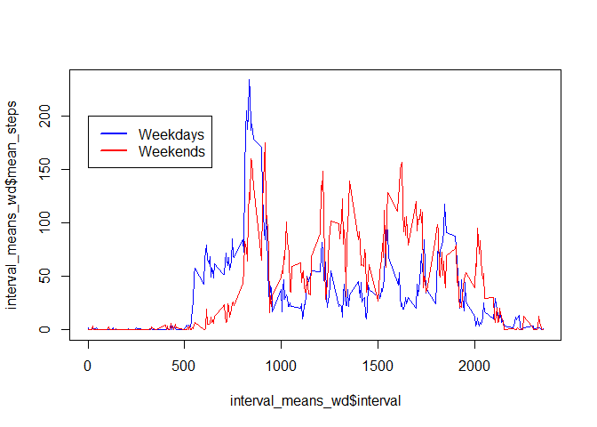

# Reproducible Research: Peer Assessment 1


## Loading and preprocessing the data
In order to load the data, first the file which comes with the repository needs to be unzipped with unzip() and then loaded with the read.csv() function.
After that, a version with only the complete cases will be created to remove NA values for the initial calculations. This is achieved by subsetting the original data frame with complete.cases().
Later in the article we will see how to replace those NA values but not for this first set of operations.


```r
library(dplyr)
```

```
## 
## Attaching package: 'dplyr'
## 
## The following object is masked from 'package:stats':
## 
##     filter
## 
## The following objects are masked from 'package:base':
## 
##     intersect, setdiff, setequal, union
```

```r
library(lubridate)
unzip("./activity.zip")
activity <- read.csv("./activity.csv")
summary(activity)
```

```
##      steps                date          interval     
##  Min.   :  0.00   2012-10-01:  288   Min.   :   0.0  
##  1st Qu.:  0.00   2012-10-02:  288   1st Qu.: 588.8  
##  Median :  0.00   2012-10-03:  288   Median :1177.5  
##  Mean   : 37.38   2012-10-04:  288   Mean   :1177.5  
##  3rd Qu.: 12.00   2012-10-05:  288   3rd Qu.:1766.2  
##  Max.   :806.00   2012-10-06:  288   Max.   :2355.0  
##  NA's   :2304     (Other)   :15840
```

```r
activity <- activity %>% mutate(date = ymd(date))
activity_complete <- activity[complete.cases(activity),]
```

As mentioned before, further processing of the data will happen at a later stage. However, at this point the dates were also converted using lubridate package so they can be used later easily.

## What is mean total number of steps taken per day?
In order to calculate the mean steps taken per day, I will make use of the dplyr package. This will allow for grouping in order to do the calculations.
Firstly, a grouping is made using the dates and then the mean of each date is calculated, generating a new data frame. After that, we can plot the histogram, calculate the mean across all dates and the median.


```r
daily_means <- activity_complete %>% group_by(date) %>% summarize(mean(steps))
names(daily_means)[2] <- "mean_steps"
hist(daily_means$mean_steps)
```

 

```r
mean(daily_means$mean_steps)
```

```
## [1] 37.3826
```

```r
median(daily_means$mean_steps)
```

```
## [1] 37.37847
```

## What is the average daily activity pattern?
In this case, dplyr is used again to average the steps per interval across all the dates, which is then plotted. After that, the interval with the maximum number of steps in average per day is identified and shown.


```r
interval_means <- activity_complete %>% group_by(interval) %>% summarize(mean(steps))
names(interval_means)[2] <- "mean_steps"
plot(interval_means$interval, interval_means$mean_steps, type = "l")
```

 

Hereby the interval with the maximum amount of steps 


```r
interval_means %>% filter(mean_steps == max(mean_steps))
```

```
## Source: local data frame [1 x 2]
## 
##   interval mean_steps
## 1      835   206.1698
```

## Imputing missing values
In order to calculate the number of missing values in the original data set, the function is.na() will be used.

```r
sum(is.na(activity$steps))
```

```
## [1] 2304
```

In order to fill in for all those missing values, I will use the mean for the particular interval where the NA happened.


```r
missing_v <- is.na(activity$steps)
activity_final <- activity
for (i in 1:length(missing_v)) {
        if (missing_v[i]) {
                activity_final$steps[i] <-
                  interval_means$mean_steps[
                  interval_means$interval==activity_final$interval[i]]
        }
}
```
Here is the histogram:

```r
daily_means_final <- activity_final %>% group_by(date) %>%
        summarize(mean(steps))
names(daily_means_final)[2] <- "mean_steps"
hist(daily_means_final$mean_steps)
```

 

And here are mean and median:

```r
mean(daily_means_final$mean_steps)
```

```
## [1] 37.3826
```

```r
median(daily_means_final$mean_steps)
```

```
## [1] 37.3826
```

As one can notice, the problem about inputting the missing values in the way I decided makes the median equal to the mean, skewing the study in my opinion.

## Are there differences in activity patterns between weekdays and weekends?
In order to create the new factor variable, the function weekdays().
We will do this over the data frame which does not contain the missing values nor the replacement with the mean for the day on the interval. That is, the one created at the beginning consisting only of the complete cases.


```r
days_of_week <- weekdays(activity_complete$date)
new_factor <- ifelse((days_of_week == "Saturday" | days_of_week == "Sunday"),
                     "weekend", "weekday")
activity_wd_we <- activity_complete %>% mutate(weekday_end = new_factor)
```

Now, means are calculated for weekdays and weekends and plots are generated:

```r
interval_means_wd <- activity_wd_we %>% filter(weekday_end == "weekday") %>%
        group_by(interval) %>% summarize(mean(steps))
names(interval_means_wd)[2] <- "mean_steps"
interval_means_we <- activity_wd_we %>% filter(weekday_end == "weekend") %>%
        group_by(interval) %>% summarize(mean(steps))
names(interval_means_we)[2] <- "mean_steps"
plot(interval_means_wd$interval, interval_means_wd$mean_steps, type = "l",
     col='blue')
lines(interval_means_we$interval, interval_means_we$mean_steps, col='red')
legend(0, 200, c("Weekdays","Weekends"), lty=c(1,1), lwd=c(2.5,2.5),
       col=c("blue","red"))
```

 
